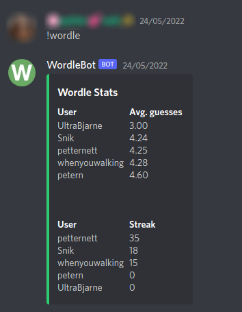

# Wordle Discord Bot
Self-hosted Discord bot. Gather and display statistics about Wordle games in a Discord channel or thread.

## Features
- Lists all Wordle players in the server
- Ranks players based on average number of guesses
- Keeps track of each player's streak (useful if playing across multiple devices)
- Reads all previously posted results

## Planned features
- Details for specific players (`!wordle <user>`)
- Earliest post in the day on average
- Player with best started word on average
- Fair overall game score (players who play more often get higher scores)

## Requirements
Requires Python 3.8+, [discord.py v1.7.3](https://pypi.org/project/discord.py/), [asyncio v.3.4.3](https://pypi.org/project/asyncio/), [emoji v2.0.0](https://pypi.org/project/emoji/), [apscheduler v3.9.1](https://pypi.org/project/APScheduler/).

You can install the requirements with `pip install -r requirements.txt`

## Installation
[Create a bot account](https://discordpy.readthedocs.io/en/stable/discord.html) and invite it to your server.
It requires permission to read historical chat data and post messages, as well as the `message_content` intent enabled.

Set the token in a file in the same directory as `wordle_bot.py` called `secret.py` in which you set `token = "YOUR_TOKEN_HERE"`.

## Running

Once it is in the server, invoke it in a channel with the command `!wordle`.
On the first run, it will then read through all messages in that channel/thread and store all Wordle scores and streaks (this may take a while, depending on the size of the channel/thread).
After this, it will continously add Wordle scores as they are posted.
